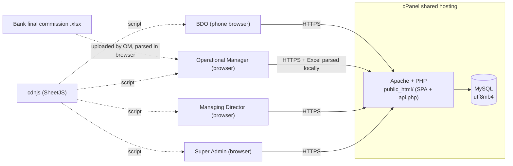
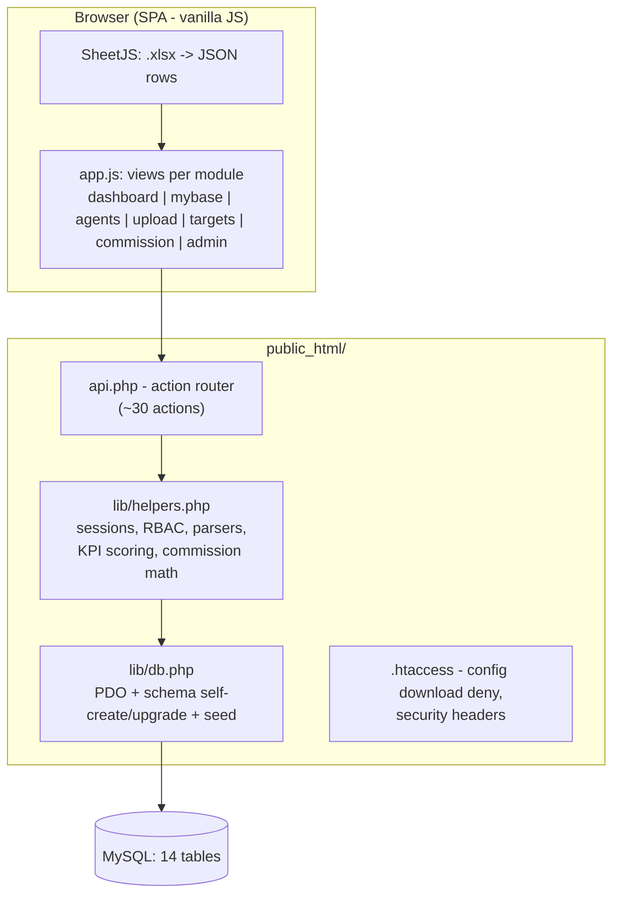
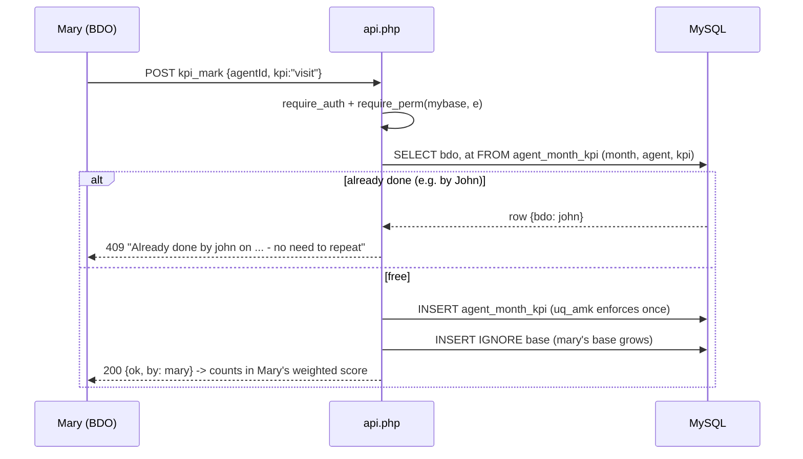
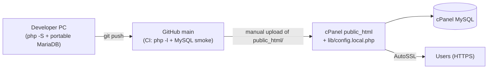

# System Design Document — HLD + LLD + Architecture Diagrams

**System:** IMANI SUPERDEALER · **Version:** 1.2.0 · **Date:** 2026-07-14

---

## 1. High-Level Design (HLD)

### 1.1 Architecture style

Single-service **PHP monolith** with an RPC-style JSON API and a static single-page front-end,
backed by one MySQL database. Chosen deliberately for shared-hosting compatibility (see
[Decision Log](12-Risk-Decision-Log.md), D-2). Excel parsing happens **client-side** (SheetJS),
so the server only ever receives JSON.

### 1.2 System context



### 1.3 Container/component view



### 1.4 Key design properties

| Property | Approach |
|---|---|
| Deployability | Copy folder + one config file; schema creates/upgrades itself (`schema_version`) |
| Multi-user integrity | DB unique key on (month, agent, KPI) — race-safe first-wins |
| Confidentiality | Column stripping server-side per role; RBAC on every action |
| State | All state in MySQL; PHP sessions for auth; front-end stateless on reload |
| Extensibility | New module = permission row + API case + view function; new role = data row |

---

## 2. Low-Level Design (LLD)

### 2.1 File map

| File | Responsibility |
|---|---|
| `public_html/index.html` | Shell, favicon, loads SheetJS + `app.js` (cache-busted `?v=N`) |
| `public_html/app.js` | SPA: state, fetch wrapper, sidebar shell, 7 views, modals, toasts, KPI chips |
| `public_html/styles.css` | Fire theme design tokens, sidebar, cards, tables, chips, bars, modal |
| `public_html/api.php` | Single switch over `?action=`; every case does auth → permission → work → JSON |
| `public_html/lib/db.php` | `cfg()` (config + env overrides), `db()` PDO singleton, `ensure_schema()`, `upgrade_schema()`, `seed()` |
| `public_html/lib/helpers.php` | `respond/fail/body`, `start_session/current_user/require_auth`, `perms_for_role/can/require_perm`, `audit`, month helpers, row normalizers (`parse_weekly_row`, `parse_commission_row`), `month_actuals/bdo_actuals/kpi_defs/bdo_score`, `release_for` |
| `public_html/lib/config.sample.php` | Template for `config.local.php` (gitignored) |

### 2.2 Request lifecycle

Every API call: `api.php?action=X` → `require_auth()` (session → users row, active check) →
`require_perm(user, module, level)` (superadmin bypass; else permissions table) → business logic
via prepared statements → `respond(json)` / `fail(msg, code)`. Errors: PDOException → generic 500
("Database error…"); anything else → generic 500; nothing internal leaks.

### 2.3 Core algorithms

**KPI first-wins (race-safe).** `kpi_mark` SELECTs the ledger row for (open month, agent, kpi);
if present → 409 with owner + timestamp. Else INSERT (unique key `uq_amk` guarantees a concurrent
double-submit still yields one row). `served` additionally logs a `service_history` row; every mark
adds the agent to the marker's base (`INSERT IGNORE`).

**Weekly upload.** For each JSON row: normalize headers (`norm_key` — lowercase, alnum only) →
resolve BDO (row column → form choice → `unassigned`; unknown names auto-create a `bdo` user) →
upsert agent by account (only non-empty fields overwrite) → insert `service_history` →
`INSERT IGNORE` base membership + ledger entries for SERVED/visit=YES/apk=YES/activeness Active*.

**Weighted score.** `bdo_score(actuals, targets)` — per KPI: pct = min(100, actual/target×100);
score = Σ(pct×weight)/Σ(weights) over KPIs with weight>0 AND target>0 (renormalized);
flag = red(<50) | mid | excellent(≥80).

**Month close.** Requires `commission_calc` row → set CLOSED → ensure next month OPEN →
`INSERT IGNORE` into next month's base `(bdo, agent, 'priority')` for every DISTINCT served pair
of the closing month.

### 2.4 Sequence — BDO marks a KPI (with blocking)



### 2.5 Sequence — month close with carry-forward

```mermaid
sequenceDiagram
  participant OM
  participant A as api.php
  participant D as MySQL
  OM->>A: POST month_close {month: 2026-07}
  A->>D: has commission_calc for 2026-07?
  alt no calc saved
    A-->>OM: 400 "Upload the final commission file and Calculate & Save first"
  else
    A->>D: months: 2026-07 -> CLOSED; ensure 2026-08 OPEN
    A->>D: INSERT IGNORE base(2026-08, bdo, agent, priority)\nSELECT DISTINCT bdo, agent FROM service_history\nWHERE month=2026-07 AND served
    A-->>OM: 200 {closed, carried, next}
  end
```

### 2.6 Deployment view



### 2.7 Front-end structure (app.js)

- `state` singleton: user, perms, tab, month, cached lists.
- `api(action, {qs, body})` fetch wrapper: same-origin cookies; 401 → back to login; error toasts.
- `visibleModules()` derives the sidebar from View permissions (BDOs additionally get `agents`).
- Views are pure functions writing `innerHTML` into `#view`; skeleton shimmer while loading.
- Event delegation: one document-level click/change/input/submit handler routed by `data-action`.
- Shared components: `card()`, `kpiChips()`, `flagPill()`, `perfBars()`, `openModal()/closeModal()`, `toast()`.
