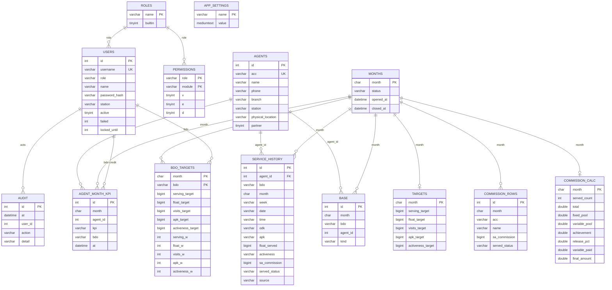

# Database Design — ERD, Schema, Data Dictionary

**DBMS:** MySQL 5.7+/8.x or MariaDB 10.4+ · charset **utf8mb4** · engine **InnoDB**
**Creation:** automatic — `lib/db.php ensure_schema()` creates everything on first request;
`upgrade_schema()` applies versioned upgrades (`app_settings.schema_version`, currently **2**).

---

## 1. ERD

> Note: `month`, `bdo` links are logical (by value), not declared FKs — deliberate for
> shared-hosting simplicity and tolerant imports; integrity is enforced in code paths.
> The only hard FK-like invariant is the **unique key** `uq_amk (month, agent_id, kpi)`.

## 2. Data dictionary

### users
| Column | Type | Notes |
|---|---|---|
| id | INT PK AI | |
| username | VARCHAR(64) UNIQUE | lowercase login id; also the BDO key used in ledger/base |
| role | VARCHAR(32) | FK-by-value → roles.name (`superadmin`,`md`,`om`,`bdo`, custom) |
| name | VARCHAR(128) | display name; weekly upload matches BDO column against it |
| password_hash | VARCHAR(255) | bcrypt (`password_hash`) |
| station | VARCHAR(64) | informational |
| active | TINYINT(1) | 0 blocks login and admin lists |
| failed / locked_until | INT / INT | lockout: 6 fails → unix-ts lock for 900s |

### roles
`name` (PK), `builtin` (1 = superadmin/md/om/bdo, protected). Custom roles addable by Super Admin.

### permissions
Composite PK (role, module). `v/e/d` = View/Edit/Delete flags per module
(`dashboard, agents, mybase, upload, targets, commission, admin`). Superadmin bypasses the table.

### agents (master list)
| Column | Type | Notes |
|---|---|---|
| acc | VARCHAR(64) UNIQUE | agent account — the upsert key for uploads |
| name/phone/branch/station | VARCHAR | non-empty upload values overwrite |
| physical_location | VARCHAR(255) | shown to all roles incl. BDO restricted view |
| partner | TINYINT(1) | hidden from BDOs |

### service_history (event log)
One row per upload row or live `served` mark. `month` CHAR(7) `YYYY-MM`; `odk/apk` YES|NO;
`served_status` SERVED|NOT_SERVED; `float_served`, `sa_commission` BIGINT; `source` weekly|bdo.
Indexes: (month, bdo), (agent_id). Float actuals are summed from here.

### agent_month_kpi (shared KPI ledger — the anti-duplication core)
| Column | Type | Notes |
|---|---|---|
| month | CHAR(7) | |
| agent_id | INT | |
| kpi | VARCHAR(12) | `served` \| `visit` \| `apk` \| `active` |
| bdo | VARCHAR(64) | credited username (first-wins) |
| at | DATETIME | when credited |
| **UNIQUE uq_amk** | (month, agent_id, kpi) | race-safe once-per-month guarantee |

Fed by: live `kpi_mark`, weekly upload (INSERT IGNORE), v1→v2 backfill from service_history.

### base (working base membership)
(month, bdo, agent_id, kind) with kind `priority` (carried on month close) | `uploaded`;
UNIQUE across the quad. Drives My Agent Base counts and levels.

### targets (office) & bdo_targets (per-BDO + weights)
Five `*_target` BIGINT columns for Serving/Float/Visits/APK/Activeness. `bdo_targets` adds five
`*_w` INT weight percentages (API enforces Σ = 100) and is keyed (month, bdo).

### months
`month` PK, `status` OPEN | AWAITING | CLOSED, opened_at, closed_at. Exactly the newest OPEN month
receives live marks; CLOSED months reject uploads/marks/commission changes.

### commission_rows / commission_calc
`commission_rows`: parsed final-file rows per month (replaced on re-upload).
`commission_calc`: one row per month — served_count, total, fixed_pool (30%), variable_pool (70%),
achievement, release_pct, variable_paid, final_amount. Prerequisite for month close.

### audit / app_settings
`audit`: at, user_id, action (login, weekly_upload, kpi_mark, permissions_update, user_add,
month_open, month_close, commission_*, …), detail. `app_settings`: key/value (schema_version).

## 3. Sizing & growth

Dominant tables: service_history and agent_month_kpi ≈ (agents × uploads) and (agents × 4) per
month. At 1,000 agents × 5 uploads/month ≈ 5k + 4k rows/month ≈ <10 MB/year — far below shared
hosting limits. Existing indexes cover all hot queries (month+bdo, agent lookups by id/acc).

## 4. Backup & retention

Nightly `mysqldump` (cPanel backup tool or cron). The database is the only state; code is on
GitHub. Retain 30 daily + 12 monthly dumps. Restore = import dump + upload code + config.
